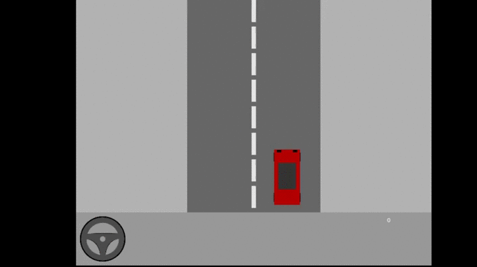

# LuaWheel
**Logitech Steering Wheel Implementation for Lua**


This module adds low-level access to Logitech Steering Wheel SDK.

Supported devices are listed here: [SupportedDevices](#supporteddevices)

## Usage
- Put __luawheel.dll__ and __LogitechSteeringWheel.dll__ in your `cpath`. 

```lua
	Wheel = require("luawheel")
```

*Note*: If you require LuaWheel when your window (HWND) is not in foreground, this will silently fail, but all functions will be available. Use [.IsAvailable()](#isavailable) to check when LuaWheel is ready.

Demo available in LoveWheelTest. Note: it was tested only on "Logitech MOMO Racing Force Feedback Wheel".


## Preparing
Download Logitech Steering Wheel .lib files, headers and demo-tester [here](https://www.logitechg.com/en-roeu/innovation/developer-lab.html)

To build it for your system you need a DirectX installed (dinput.h is required).
If you can build in VSCode, use .lib files from the SDK. I didn't understand how to include them so I use a .dll.

It's included in ***files.zip*** (Originally comes with Logitech Gaming Software).

This module (and the SDK) works **only** on Windows.

If you managed to compile it for 32-bit, please create an issue ticket and I will include it.

## Lua API

### Enumerations

#### SupportedDevices
- CORDLESS_RUMBLEPAD_2
- G940_PEDALS
- ATTACK_3
- EXTREME_3D_PRO
- MOMO_RACING
- FREEDOM_24
- FORCE_3D
- DRIVING_FORCE
- NASCAR_RACING_WHEEL
- G940_THROTTLE
- FORMULA_FORCE_GP
- G29
- FORMULA_FORCE
- RUMBLEPAD_2
- MOMO_FORCE
- FORCE_3D_PRO
- G940_JOYSTICK
- PRECISION_GAMEPAD_2
- CORDLESS_GAMEPAD
- DRIVING_FORCE_GT
- RUMBLEPAD
- DUAL_ACTION_GAMEPAD
- STRIKE_FORCE_3D
- G27
- DRIVING_FORCE_PRO
- G25
- G920
- CHILLSTREAM
#### DeviceTypes
- NONE
- JOYSTICK
- OTHER
- GAMEPAD
- WHEEL
#### PeriodicTypes
- NONE
- SQUARE
- SINE
- TRIANGLE
#### ForceTypes
- DIRT_ROAD
- SPRING
- FRONTAL_COLLISION
- BUMPY_ROAD
- CAR_AIRBORNE
- CONSTANT
- SOFTSTOP
- SURFACE_EFFECT
- SIDE_COLLISION
- SLIPPERY_ROAD
- DAMPER
#### ManufactureTypes
- NONE
- OTHER
- MICROSOFT
- LOGITECH

### LuaWheel Info

#### .GetVersion
```lua
	ver = Wheel.GetVersion()
```

*Returns:*
- ver [number]: Installed version of LuaWheel

### Global Functions

#### .IsAvailable
```lua
	status = Wheel.IsAvailable()
```

*Returns:*
- status [boolean]: Returns `true` if the module successfully initialized. Could return `false` if the window have't appeared in foreground after requiring LuaWheel.

#### .GetDevices
```lua
	slots = Wheel.GetDevices()
```

*Returns:*
- slots [table]: Array of connected devices (5 or 4 max). Returned as model name.

#### .IsDeviceConnected
```lua
	status = Wheel.IsDeviceConnected(DeviceID)
```

*Arguments:*
- DeviceID [number]: Integer from 1 to 4.

*Returns:*
- status [boolean]: Returns `true` if there's a device at the given index.

#### .SetPreferredProperties
```lua
	status = Wheel.SetPreferredProperties(LogiControllerPropertiesDataTable)
```

*Arguments:*
- LogiControllerPropertiesDataTable [table]: struct (See also [.GetWheelProperties](#getwheelproperties))
  - forceEnable [boolean]: Is force feedback active.
  - overallGain [number]: Overall gain of inputs.
  - springGain [number]: Accelerator gain.
  - damperGain [number]: Brake gain.
  - defaultSpringEnabled [boolean]: Use default accelerator gain .
  - defaultSpringGain [number]: Default accelerator gain.
  - combinePedals [boolean]: Is pedals combined.
  - wheelRange [number]: Rotation range of wheel.
  - gameSettingsEnabled [boolean]: Enable game settings.
  - allowGameSettings [boolean]: Is game settings allowed.

*Returns:*
- status [boolean]: Returns `true` if successful.

#### .GetDeviceType
```lua
	status = Wheel.GetDeviceType(DeviceID, [ENUMDeviceTypesToCompare])
```

*Arguments:*
- DeviceID [number]: Integer from 1 to 4.
- \(Optional\) ENUMDeviceTypesToCompare [number]: Compares device DeviceType with the given enum. 

*Returns:*
- status [boolean]: Returns the [DeviceTypes](#devicetypes) enum. Returns `true` if the second argument is passed and it matches with the device DeviceType. Returns `false` if no device connected to the given DeviceID.

#### .GetDeviceModel
```lua
	status = Wheel.GetDeviceModel(DeviceID, [ENUMSupportedDevicesToCompare])
```

*Arguments:*
- DeviceID [number]: Integer from 1 to 4.
- \(Optional\) ENUMSupportedDevicesToCompare [number]: Compares device DeviceModel with the given enum. 

*Returns:*
- status [boolean]: Returns the [SupportedDevices](#supporteddevices) enum. Returns `true` if the second argument is passed and it matches with the device DeviceModel. Returns `false` if no device connected to the given DeviceID.

#### .GetDeviceManufacturer
```lua
	status = Wheel.GetDeviceManufacturer(DeviceID, [ENUMManufactureTypesToCompare])
```

*Arguments:*
- DeviceID [number]: Integer from 1 to 4.
- \(Optional\) ENUMManufactureTypesToCompare [number]: Compares device ManufactureType with the given enum. 

*Returns:*
- status [boolean]: Returns the [ManufactureTypes](#manufacturetypes) enum. Returns `true` if the second argument is passed and it matches with the device ManufactureType. Returns `false` if no device connected to the given DeviceID.

### Enumeration converters

#### .DeviceTypeToName
```lua
	readableName = Wheel.DeviceTypeToName(ENUMDeviceTypes)
```

*Arguments:*
- ENUMDeviceTypes [number]: DeviceTypes enum.

*Returns:*
- readableName [string]: Returns the DeviceType enum name.

#### .DeviceModelToName
```lua
	readableName = Wheel.DeviceModelToName(ENUMSupportedDevices)
```

*Arguments:*
- ENUMSupportedDevices [number]: SupportedDevices enum.

*Returns:*
- readableName [string]: Returns the SupportedDevices enum name.

#### .DeviceManufacturerToName
```lua
	readableName = Wheel.DeviceManufacturerToName(ENUMManufactureTypes)
```

*Arguments:*
- ENUMManufactureTypes [number]: ManufactureTypes enum.

*Returns:*
- readableName [string]: Returns the ManufactureTypes enum name.

#### .ForceTypesToName
```lua
	readableName = Wheel.ForceTypesToName(ENUMForceTypes)
```

*Arguments:*
- ENUMForceTypes [number]: ForceTypes enum.

*Returns:*
- readableName [string]: Returns the ForceTypes enum name.


### Wheel Get Functions

#### .GetWheelData
```lua
	DIJOYSTATE2 = Wheel.GetWheelData(DeviceID)
```

*Arguments:*
- DeviceID [number]: Integer from 1 to 4.

*Returns:*
- DIJOYSTATE2 [table]: struct
```cpp
	int				lX;                     /* x-axis position              */
	int				lY;                     /* y-axis position              */
	int				lZ;                     /* z-axis position              */
	int				lRx;                    /* x-axis rotation              */
	int				lRy;                    /* y-axis rotation              */
	int				lRz;                    /* z-axis rotation              */
	int				rglSlider[2];           /* extra axes positions         */
	unsigned int	rgdwPOV[4];             /* POV directions               */
	unsigned char   rgbButtons[128];        /* 128 buttons                  */
	int				lVX;                    /* x-axis velocity              */
	int				lVY;                    /* y-axis velocity              */
	int				lVZ;                    /* z-axis velocity              */
	int				lVRx;                   /* x-axis angular velocity      */
	int				lVRy;                   /* y-axis angular velocity      */
	int				lVRz;                   /* z-axis angular velocity      */
	int				rglVSlider[2];          /* extra axes velocities        */
	int				lAX;                    /* x-axis acceleration          */
	int				lAY;                    /* y-axis acceleration          */
	int				lAZ;                    /* z-axis acceleration          */
	int				lARx;                   /* x-axis angular acceleration  */
	int				lARy;                   /* y-axis angular acceleration  */
	int				lARz;                   /* z-axis angular acceleration  */
	int				rglASlider[2];          /* extra axes accelerations     */
	int				lFX;                    /* x-axis force                 */
	int				lFY;                    /* y-axis force                 */
	int				lFZ;                    /* z-axis force                 */
	int				lFRx;                   /* x-axis torque                */
	int				lFRy;                   /* y-axis torque                */
	int				lFRz;                   /* z-axis torque                */
	int				rglFSlider[2];          /* extra axes forces            */
```

#### .GetWheelProperties
```lua
	LogiControllerPropertiesDataTable = Wheel.GetWheelProperties(DeviceID)
```

*Arguments:*
- DeviceID [number]: Integer from 1 to 4.

*Returns:*
- LogiControllerPropertiesDataTable [table]: struct (See also [.SetPreferredProperties](#setpreferredproperties))
  - forceEnable [boolean]: Is force feedback active.
  - overallGain [number]: Overall gain of inputs.
  - springGain [number]: Accelerator gain.
  - damperGain [number]: Brake gain.
  - defaultSpringEnabled [boolean]: Use default accelerator gain .
  - defaultSpringGain [number]: Default accelerator gain.
  - combinePedals [boolean]: Is pedals combined.
  - wheelRange [number]: Rotation range of wheel.
  - gameSettingsEnabled [boolean]: Enable game settings.
  - allowGameSettings [boolean]: Is game settings allowed.

#### .GetWheelProperties
```lua
	status = Wheel.GetWheelShiterMode(DeviceID)
```

*Arguments:*
- DeviceID [number]: Integer from 1 to 4.

*Returns:*
- status [number]: Returns current shifter mode (gated or sequential). `1` if shifter is gated, `0` if shifter is sequential, `-1` if unknown.

#### .GetWheelForceFeedback
```lua
	status = Wheel.GetWheelForceFeedback(DeviceID)
```

*Arguments:*
- DeviceID [number]: Integer from 1 to 4.

*Returns:*
- status [boolean]: Returns `true` if the controller at index has force feedback.

#### .GetWheelOperatingRange
```lua
	status = Wheel.GetWheelOperatingRange(DeviceID)
```

*Arguments:*
- DeviceID [number]: Integer from 1 to 4.

*Returns:*
- status [number]: Returns the range parameter of the controller with the current controller
operating range. Returns `false` if failed.

#### .GetWheelControls
```lua
	rotation,accelerator,brake = Wheel.GetWheelControls(DeviceID)
```

*Arguments:*
- DeviceID [number]: Integer from 1 to 4.

*Returns:*
- rotation [number]: Wheel rotation position. ( Internally uses Wheel.GetWheelData(DeviceID).lX )
- accelerator [number]: Accelerator (Gas) pedal position. ( Internally uses Wheel.GetWheelData(DeviceID).lY )
- brake [number]: Brake pedal position. ( Internally uses Wheel.GetWheelData(DeviceID).lRz )

#### .GetWheelPosition
```lua
	rotation = Wheel.GetWheelPosition(DeviceID)
```

*Arguments:*
- DeviceID [number]: Integer from 1 to 4.

*Returns:*
- rotation [number]: Wheel rotation position. ( Internally uses Wheel.GetWheelData(DeviceID).lX )

#### .GetWheelAccelerator
```lua
	accelerator = Wheel.GetWheelAccelerator(DeviceID)
```

*Arguments:*
- DeviceID [number]: Integer from 1 to 4.

*Returns:*
- accelerator [number]: Accelerator (Gas) pedal position. ( Internally uses Wheel.GetWheelData(DeviceID).lY )

#### .GetWheelBrake
```lua
	brake = Wheel.GetWheelBrake(DeviceID)
```

*Arguments:*
- DeviceID [number]: Integer from 1 to 4.

*Returns:*
- brake [number]: Brake pedal position. ( Internally uses Wheel.GetWheelData(DeviceID).lRz )

#### .GetWheelForceType
```lua
	status = Wheel.GetWheelForceType(DeviceID, [ENUMForceTypesToCompare])
```

*Arguments:*
- DeviceID [number]: Integer from 1 to 4.
- \(Optional\) ENUMForceTypesToCompare [number]: Compares device ForceType with the given enum. 

*Returns:*
- status [boolean]: Returns the [ForceTypes](#forcetypes) enum. Returns `true` if the second argument is passed and it matches with the device ForceType. Returns `false` if no device connected to the given DeviceID.

#### .GetWheelButtons
```lua
	buttons = Wheel.GetWheelButtons(DeviceID)
```

*Arguments:*
- DeviceID [number]: Integer from 1 to 4.

*Returns:*
- buttons [table]: Array of pressed buttons. Unpressed buttons will be `nil` here. From 1 to 128.

#### .ToWheelNonLinear
```lua
	nonlinear = Wheel.ToWheelNonLinear(DeviceID)
```

*Arguments:*
- DeviceID [number]: Integer from 1 to 4.

*Returns:*
- nonlinear [number]: Value between -32768 and 32767. corresponding to the level of non-linearity previously set with [.SetWheelNonLinear()](#setwheelnonlinear).

### Wheel Set Functions

#### .SetWheelForceType
```lua
	status = Wheel.SetWheelForceType(DeviceID, ENUMForceTypes, OnOrOff, [...])
```

See `LogitechGamingSteeringWheelSDK.pdf` from the Steering Wheel SDK for descriptions of each ForceType settings.

*Arguments:*
- DeviceID [number]: Integer from 1 to 4.
- ENUMForceTypes [number]: [ForceTypes](#forcetypes) enums. Affects `...`.
- OnOrOff [boolean]: Decides the state of the force effect.
- \(Optional\) ... [vararg]:
  - Empty if `OnOrOff = false`.
  - ForceType SPRING: offsetPercentage [number], saturationPercentage [number], coefficientPercentage [number].
  - ForceType CONSTANT: magnitudePercentage [number].
  - ForceType DAMPER: coefficientPercentage [number].
  - ForceType SIDE_COLLISION: magnitudePercentage [number].
  - ForceType FRONTAL_COLLISION: magnitudePercentage [number].
  - ForceType DIRT_ROAD: magnitudePercentage [number].
  - ForceType BUMPY_ROAD: magnitudePercentage [number].
  - ForceType SLIPPERY_ROAD: magnitudePercentage [number].
  - ForceType SURFACE_EFFECT: [ENUMPeriodicTypes](#periodictypes) [number], magnitudePercentage [number], period [number] \(Recommended: 20 to 150. > 150 is clamped\)
  - ForceType SOFTSTOP: usableRangePercentage [number]
  - ForceType CAR_AIRBORNE: empty.

*Returns:*
- status [boolean]: Returns `true` if successful.

#### .SetWheelNonLinear
```lua
	status = Wheel.SetWheelNonLinear(DeviceID,Curve)
```

*Arguments:*
- DeviceID [number]: Integer from 1 to 4.
- Curve [number]: Range is -100 to 100. `0` = linear curve, `100` = maximum non-linear curve with less sensitivity around center, `-100` = maximum non-linearity with more sensitivity around center position.

*Returns:*
- status [boolean]: Returns `true` if successful.

#### .SetWheelOperatingRange
```lua
	status = Wheel.SetWheelOperatingRange(DeviceID,Range)
```

*Arguments:*
- DeviceID [number]: Integer from 1 to 4.
- Range [number]: Probably a wheel rotation range.

*Returns:*
- status [boolean]: Returns `true` if successful.

#### .SetWheelLED
```lua
	status = Wheel.SetWheelLED(DeviceID,CurrentRPM,TurnLED1On,TurnLED2On)
```

*Arguments:*
- DeviceID [number]: Integer from 1 to 4.
- CurrentRPM [number]: Current RPM for comparison.
- TurnLED1On [number]: RPM when first LEDs are to turn on
- TurnLED2On [number]: just below this RPM, all LEDs will be on. Just above, all LEDs will start flashing.

*Returns:*
- status [boolean]: Returns `true` if successful.

#### .IsWheelButtonTriggered
```lua
	status = Wheel.IsWheelButtonTriggered(DeviceID,ButtonID)
```

*Doesn't work for me, use .GetWheelButtons*

*Arguments:*
- DeviceID [number]: Integer from 1 to 4.
- ButtonID [number]: Button from 1 to 128.

*Returns:*
- status [boolean]: Returns `true` if button was triggered.

#### .IsWheelButtonPressed
```lua
	status = Wheel.IsWheelButtonPressed(DeviceID,ButtonID)
```

*Doesn't work for me, use .GetWheelButtons*

*Arguments:*
- DeviceID [number]: Integer from 1 to 4.
- ButtonID [number]: Button from 1 to 128.

*Returns:*
- status [boolean]: Returns `true` if button was pressed.

#### .IsWheelButtonReleased
```lua
	status = Wheel.IsWheelButtonReleased(DeviceID,ButtonID)
```

*Doesn't work for me, use .GetWheelButtons*

*Arguments:*
- DeviceID [number]: Integer from 1 to 4.
- ButtonID [number]: Button from 1 to 128.

*Returns:*
- status [boolean]: Returns `true` if button was released.